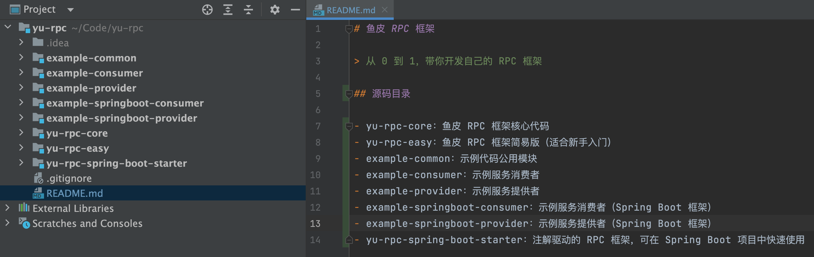
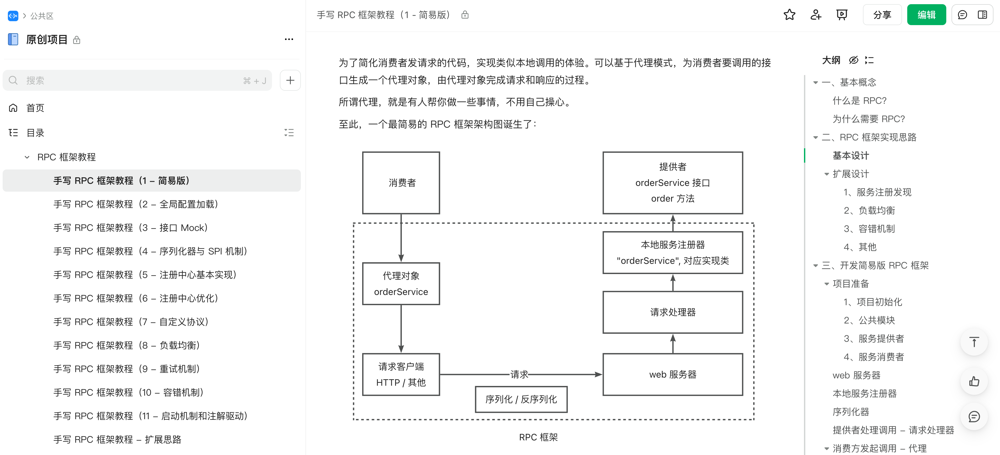

# 鱼皮 RPC 框架

> 从 0 到 1，带你开发自己的 RPC 框架
>
> 鱼皮原创项目教程系列：https://yuyuanweb.feishu.cn/wiki/SePYwTc9tipQiCktw7Uc7kujnCd

## 项目介绍

基于 Java + Etcd + Vert.x 的高性能 RPC 框架，用新颖的技术栈从 0 到 1 带大家开发轮子。教程由浅入深，可以学习并实践基于 Vert.x 的网络服务器、序列化器、基于 Etcd 和 ZooKeeper 的注册中心、反射、动态代理、自定义网络协议、多种设计模式（单例 / 工厂 / 装饰者等）、负载均衡器设计、重试和容错机制、Spring Boot Starter 注解驱动开发等，大幅提升架构设计能力。

项目分为基础版和扩展版：

- 基础版只需学几个小时，就能写在简历上的小项目~
- 扩展版将是充满亮点的技术类项目，搭配一个业务项目，让简历更有竞争力。

> 开始学习或了解详情：[手写 RPC 框架（24 年最新）](https://yuyuanweb.feishu.cn/wiki/EweIwSYsXiEvCDkzS8BcTiAonyc)
>
> 开源地址：https://github.com/liyupi/yu-rpc
>
> [教程第一章可免费学习](https://www.code-nav.cn/course/1768543954720022530/section/1768545847093518337)
>
> [导学视频 - RPC 讲解](https://www.bilibili.com/video/BV1AJ4m1H7XL)

## 项目展示

目录结构：

详细的保姆级文字教程：

## 技术选型

### 后端

后端技术以 Java 为主，但所有的思想和设计都是可以复用到其他语言的，代码不同罢了。

- ⭐️ Vert.x 框架
- ⭐️ Etcd 云原生存储中间件（jetcd 客户端）
- ZooKeeper 分布式协调工具（curator 客户端）
- ⭐️ SPI 机制
- ⭐️ 多种序列化器
  - JSON 序列化
  - Kryo 序列化
  - Hessian 序列化
- ⭐️ 多种设计模式
  - 双检锁单例模式
  - 工厂模式
  - 代理模式
  - 装饰者模式
- ⭐️ Spring Boot Starter 开发
- 反射和注解驱动
- Guava Retrying 重试库
- JUnit 单元测试
- Logback 日志库
- Hutool、Lombok 工具库

## 源码目录

- yu-rpc-core：鱼皮 RPC 框架核心代码
- yu-rpc-easy：鱼皮 RPC 框架简易版（适合新手入门）
- example-common：示例代码公用模块
- example-consumer：示例服务消费者
- example-provider：示例服务提供者
- example-springboot-consumer：示例服务消费者（Spring Boot 框架）
- example-springboot-provider：示例服务提供者（Spring Boot 框架）
- yu-rpc-spring-boot-starter：注解驱动的 RPC 框架，可在 Spring Boot 项目中快速使用

## 项目教程大纲

这个项目内容非常多，大家可以看看有没有自己想学的知识点。

### 第一章：RPC 框架简易版

1. RPC 基本概念和作用
2. RPC 框架实现思路 | 基本设计
3. RPC 框架实现思路 | 扩展设计
4. 简易版 RPC 开发 | 项目初始化
5. 简易版 RPC 开发 | web 服务器
6. 简易版 RPC 开发 | 本地服务注册器
7. 简易版 RPC 开发 | 序列化器
8. 简易版 RPC 开发 | 请求处理器
9. 简易版 RPC 开发 | 消费者代理
10. 简易版 RPC 开发 | 测试验证

### 第二章：RPC 框架扩展版

1. 全局配置加载 | 扩展版项目初始化
2. 全局配置加载 | 配置加载实现
3. 全局配置加载 | 维护全局配置对象
4. 接口 Mock 设计实现
5. 序列化器 | 主流序列化器对比
6. 序列化器 | 多种序列化器实现
7. 序列化器 | SPI 机制
8. 序列化器 | 可扩展序列化器实现（SPI + 工厂模式）
9. 注册中心 | 注册中心核心能力
10. 注册中心 | 注册中心技术选型
11. 注册中心 | Etcd 云原生中间件入门
12. 注册中心 | 基于 Etcd 实现注册中心
13. 注册中心 | 可扩展注册中心实现（SPI + 工厂模式）
14. 注册中心优化 | 心跳检测和续期机制
15. 注册中心优化 | 服务节点下线机制
16. 注册中心优化 | 消费端服务缓存
17. 注册中心优化 | 缓存更新（Etcd 监听机制）
18. 注册中心优化 | ZooKeeper 注册中心实现
19. 自定义协议 | 需求分析及方案设计
20. 自定义协议 | 消息结构设计（参考 Dubbo）
21. 自定义协议 | 网络传输设计（基于 Vert.x 实现 TCP 服务器）
22. 自定义协议 | 编码 / 解码器
23. 自定义协议 | TCP 请求处理器
24. 自定义协议 | TCP 请求客户端
25. 自定义协议 | 粘包半包问题分析
26. 自定义协议 | 使用 Vert.x 解决粘包半包问题
27. 自定义协议 | 客户端代码优化（装饰者模式）
28. 负载均衡 | 负载均衡概念和常用算法
29. 负载均衡 | 一致性 Hash
30. 负载均衡 | 多种负载均衡器实现
31. 负载均衡 | 可扩展负载均衡器实现（SPI + 工厂模式）
32. 重试机制 | 重试等待策略
33. 重试机制 | 重试方案设计
34. 重试机制 | 多种重试策略实现
35. 重试机制 | 可扩展重试策略实现（SPI + 工厂模式）
36. 容错机制 | 容错策略和实现方式
37. 容错机制 | 容错方案设计
38. 容错机制 | 多种容错策略实现
39. 容错机制 | 可扩展容错策略实现（SPI + 工厂模式）
40. 启动机制 | 框架快速启动类
41. 启动机制 | 注解驱动设计
42. 启动机制 | Spring Boot Starter 注解驱动实现
43. 项目扩展思路

## 完整项目教程学习

点击 [加入编程导航](https://yuyuanweb.feishu.cn/wiki/SDtMwjR1DituVpkz5MLc3fZLnzb) ，鱼皮往期 [所有原创项目](https://yuyuanweb.feishu.cn/wiki/SePYwTc9tipQiCktw7Uc7kujnCd) 均可学习。

